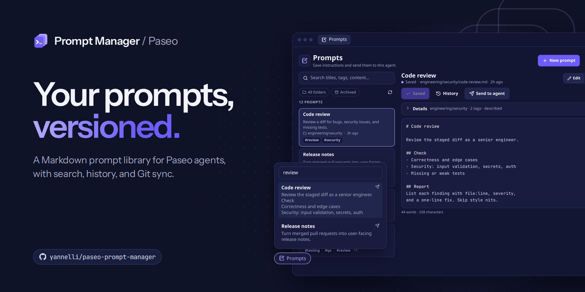
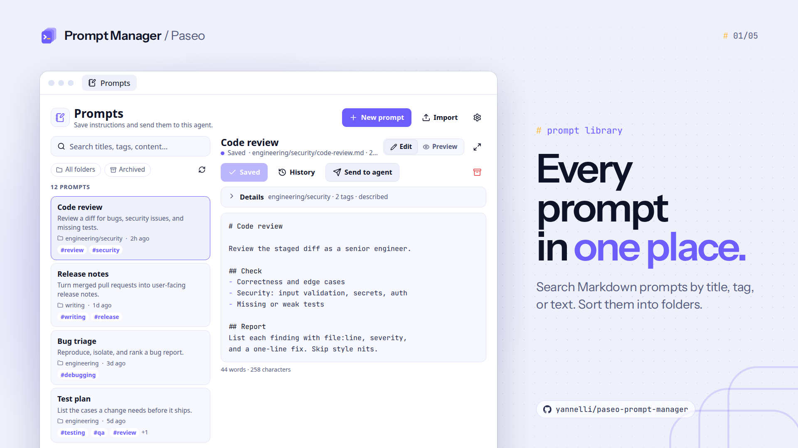
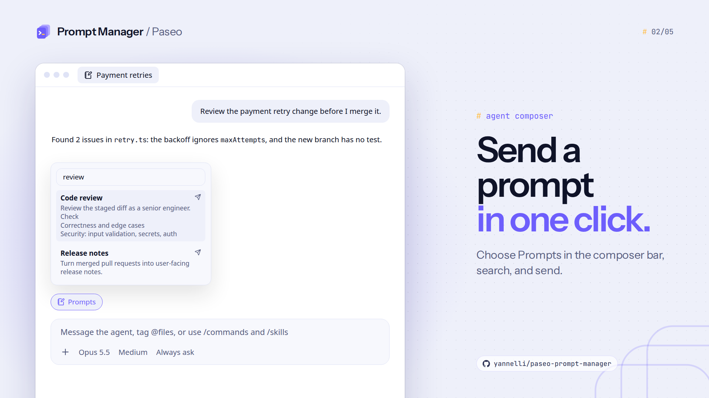
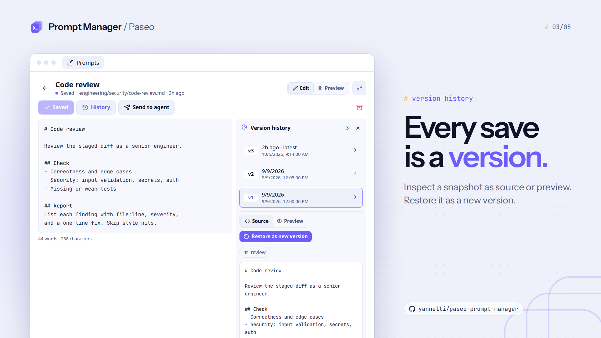
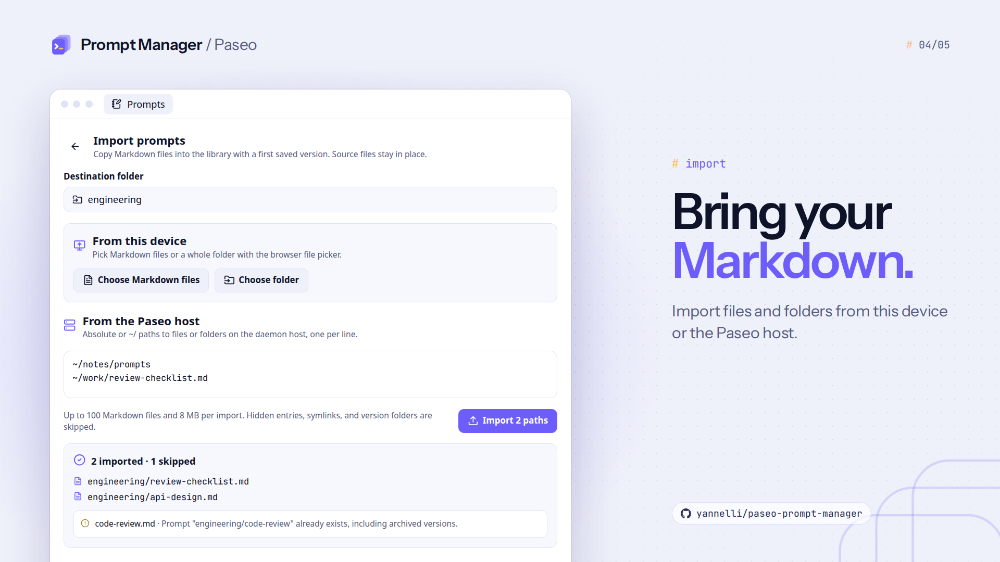
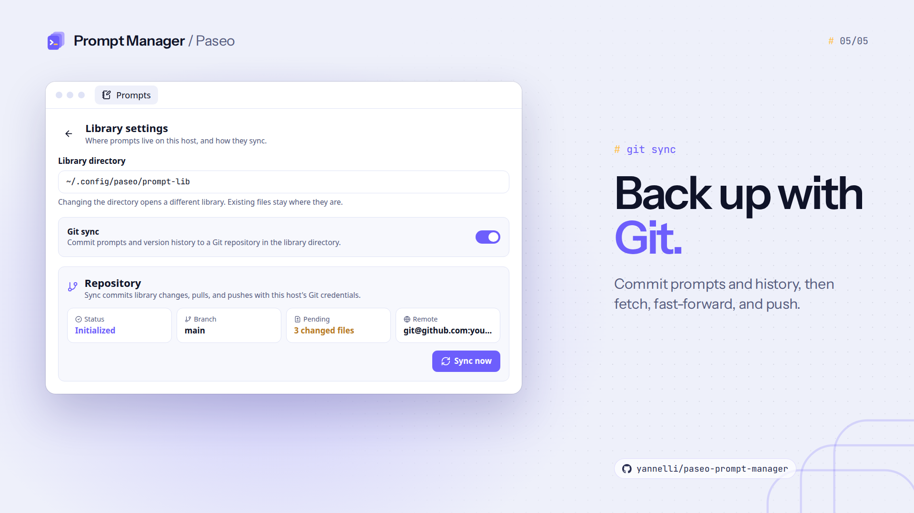

# Paseo Prompt Manager

A Markdown prompt library for [Paseo](https://paseo.sh). Create, edit, search, and reuse prompts across agents, with local version history and optional Git sync.

## Install

Enable plugins in **Settings → Plugins**, then install the beta from npm:

```sh
paseo plugin add npm:@yannelli/paseo-prompt-manager@beta
```

The beta requires Paseo `0.11.0-beta.3` or later on the daemon and on each app that shows the plugin. Git sync also requires Git on the daemon host.

For Paseo 0.9 and 0.10, install `npm:@yannelli/paseo-prompt-manager`, which holds release 0.2.0. For Paseo 0.8, install 0.2.0 from Git with `paseo plugin add yannelli/paseo-prompt-manager --ref v0.2.0`.

Open **Prompts** in the sidebar to manage your library. Paseo provides the plugin's runtime dependencies.

## Use prompts with agents

- Choose **Prompts** in the agent composer bar to search saved prompts. Each result shows the title and up to four preview lines. Choose a result to send that prompt to the agent.
- In the composer attachment menu, choose **Saved prompt**. Search by title, filename, or words in the prompt, then attach it to your message.
- Submit `/prompts` in an agent composer to open the prompt panel.
- Submit `/prompt code-review` to send `code-review.md` to the current agent and start a turn.
- From the prompt panel, choose **Send to agent** to send the selected prompt.

Attachment search matches many words across the title, filename, and content. Exact names and title matches appear first, with up to 50 results. Each result shows the title and a one-line preview of the first four body lines. Attachments contain a snapshot of the saved prompt.

## Edit and version prompts

Choose **New prompt**, enter a filename and Markdown content, then save. The first Markdown heading becomes the title. Files keep their normalized names when you edit their content.

Open **Details** in the editor to add a **Description** and comma-separated **Tags**. Search includes both fields. The folder chip above the list filters by folder and lists tags; the **Archived** chip includes archived prompts.

Folders and subfolders are directories inside the library. Create them from the folder chip or the editor's **Folder** field. Selecting another folder and saving moves the prompt and retains its version history. Nested prompts use paths such as `/prompt engineering/security/code-review`.

Use the expand button to give the editor the available workspace, and the **Edit / Preview** toggle to switch between Markdown and a formatted preview.

By default, the library lives at `~/.config/paseo/prompt-lib/`:

```text
prompt-lib/
├── code-review.md
└── versions/
    └── code-review/
        ├── code-review.2026-09-09T12-00-00-000Z_v1.md
        └── code-review.2026-09-09T12-05-00-000Z_v2.md
```

Each save creates a full Markdown snapshot. **History** opens a side panel to inspect a snapshot as source or preview and restore it as a new version. **Archive** removes the current prompt and retains its history; turn on the **Archived** chip to find it, then choose **Restore**.

Descriptions and tags use a `paseo` JSON field in Markdown frontmatter and are included in snapshots. Agents receive the prompt body. Nested history follows `versions/<folder>/<prompt-name>/<prompt-name>.<timestamp>_v<number>.md`; existing flat prompts keep their paths.

You can also edit files with your own editor. Saving a stale draft in the plugin rejects the write so you can reload the changed file. The plugin preserves externally edited content before replacing or archiving it.

## Import Markdown files and folders

Open **Prompts → Import**.

- In a browser client, use **Choose Markdown files** or **Choose folder** to import from your device.
- On any client, enter absolute paths or `~/` paths under **Files or folders on the Paseo host**, one per line, then choose **Import paths**.

Folders include subfolders. Choose an import destination to copy `.md` files into that folder and create their first versions. Folder imports preserve the selected folder and its subfolders with normalized names. Existing paths, including archived prompts, are skipped and reported. Source files stay in place.

Each import supports up to 100 Markdown files totaling 8 MB, with a 512 KB limit per file. Hidden entries, symbolic links, and `versions` folders are excluded. Host folder scans stop at 5,000 entries.

## Choose a library directory

Open **Prompts → Settings**, enter an absolute directory or `~/` path, and choose **Save settings**. Changing the directory opens a different library; it does not move files.

Preferences live at `~/.config/paseo/prompt-manager.json`. If `XDG_CONFIG_HOME` is set, it replaces `~/.config` for the default library and preferences. The library belongs to the selected daemon host and is shared across its clients and agents.

## Optional Git sync

1. Configure your Git author name, email, and remote credentials on the daemon host.
2. Turn **Git sync** on in library settings and save.
3. Choose **Initialize**. Supply an origin URL to sync with a remote, or leave it blank for local Git checkpoints.
4. Choose **Sync now** to commit prompt files and version history, fetch the remote branch, fast-forward, and push.

Sync runs when requested. Branch divergence stops the sync and leaves local commits intact. Resolve it with Git, then sync again. The library must be the repository root. Unrelated staged files block sync.

## Screenshots

These images are illustrations of the plugin UI with sample data. They are not captures of a running Paseo app. Each image is 1920×1080 in dark and light themes. See [promo images](docs/promo-images.md) to render them again.

### Prompt library



### Composer picker



### Version history



### Import



### Git sync



The dark versions are in [docs/promo/dark](docs/promo/dark). Open [docs/promo/index.html](docs/promo/index.html) to compare both themes.

## Development

Requires Node.js 24 or later and npm.

```sh
git clone https://github.com/yannelli/paseo-prompt-manager.git
cd paseo-prompt-manager
npm ci
npm run check
paseo plugin install "$PWD"
```

After changing plugin code, run the checks and reload:

```sh
paseo plugin reload paseo-prompt-manager
paseo plugin ls paseo-prompt-manager
paseo plugin logs paseo-prompt-manager
```

The tests cover storage, imports, search, versioning, conflicts, Git sync, and the release script using temporary directories and local Git remotes. Browser file-picker and desktop/mobile UI checks remain manual.

[docs/INDEX.md](docs/INDEX.md) lists project notes, including which Paseo SDK release adds each plugin API this project uses. Read it before changing `requirements.paseo` or the `@getpaseo/plugin` version.

## Releases

GitHub Actions releases on qualifying pushes to `main` and `beta`. `main` publishes `X.Y.Z` to the npm `latest` dist-tag and marks the GitHub release as Latest. `beta` publishes `X.Y.Z-beta.N` to the `beta` dist-tag as a GitHub pre-release. The workflow updates `package.json` and `package-lock.json`, pushes an annotated tag, publishes release notes, and publishes [`@yannelli/paseo-prompt-manager`](https://www.npmjs.com/package/@yannelli/paseo-prompt-manager) through npm trusted publishing (OIDC) with no npm token. See [npm publishing](docs/npm-publishing.md) for the channels, package contents, and trusted publisher setup.

Use Conventional Commits in commits and squash-merge titles:

| Commit | Version change |
| --- | --- |
| `fix:`, `perf:`, `revert:` | Patch |
| `feat:` | Minor |
| `!` after the type/scope, or a `BREAKING CHANGE:` footer | Major, including before 1.0 |
| `docs:`, `chore:`, `ci:`, and other types without a breaking marker | No release |

Run `npm run release:dry-run` from a clean `main` or `beta` checkout with all tags fetched to preview the next release. Rerun the **Release** workflow to complete a GitHub or npm publication interrupted after its tag was pushed.

## License

[MIT](LICENSE), copyright 2026 Ryan Yannelli.
